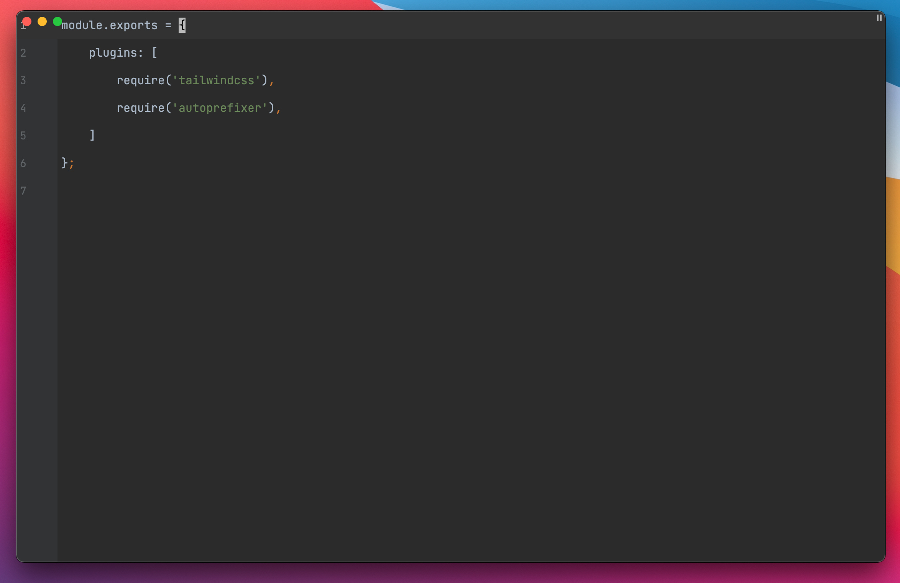
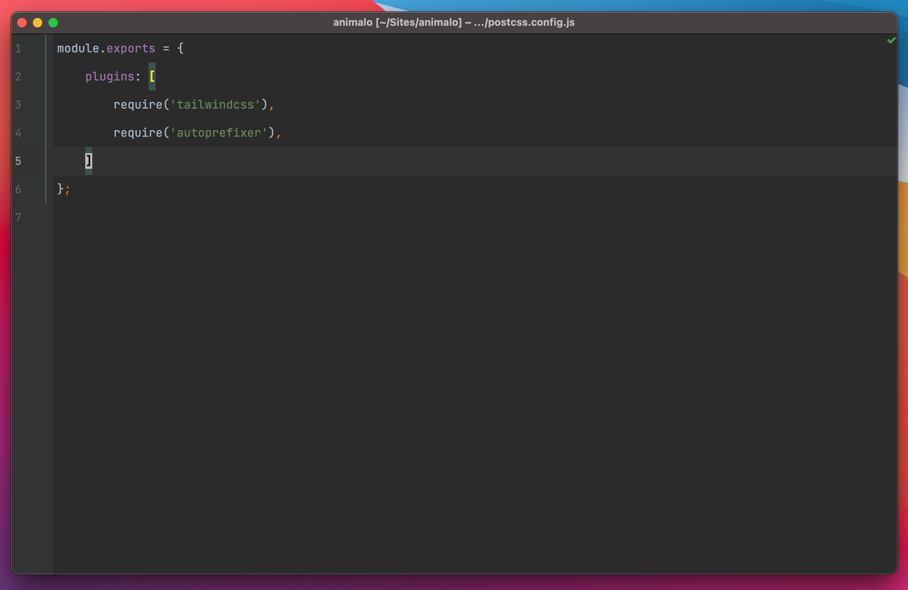

# Hide title bar

---

A very simple plugin for Jetbrains IDE's that removes
the title bar.

Yes, the close buttons will overlap the ui. It's fine 
for me, if you have a fix, please provide a pr.

All credit goes to https://github.com/Unthrottled/themed-components
of which I got all the code (I do not do any java myself).

# Screenshots

### Plugin enabled

### Plugin disabled

